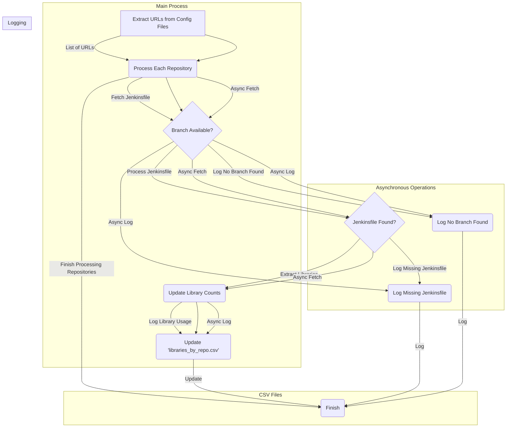

# Jenkins KPI Monitoring Dashboard

## Problem Statement

As a team actively manages numerous Jenkins build pipelines, there arises a need for a centralized Dashboard to monitor Key Performance Indicators (KPIs). The increasing complexity of projects and the scale of pipeline executions make it challenging to track the health and efficiency of our continuous integration and deployment processes. A lack of real-time insights into KPIs can lead to delayed issue detection, hampering productivity and delivery timelines.

## Why Monitor KPIs?

Monitoring KPIs is essential for several reasons:

1. Proactive Issue Detection:
   - Early identification of performance bottlenecks, failures, or deviations from standard metrics allows for prompt issue resolution.
2. Efficiency Enhancement:
   - Monitoring KPIs provides insights into pipeline efficiency, allowing teams to optimize resource allocation, reduce build times, and enhance overall workflow.
3. Resource Utilization:
   - Efficiently managing resources, such as build agents and server capacity, ensures optimal utilization and cost-effectiveness.
4. Quality Assurance:
   - Tracking KPIs aids in maintaining code and build quality, preventing the introduction of defects into the software.

## Benefits for the Team

1. Improved Productivity:
   - By having a consolidated view of KPIs, team members can quickly identify problematic areas, reducing the time spent on troubleshooting and issue resolution.
2. Data-Driven Decisions:
   - Access to real-time data empowers the team to make informed decisions, fostering a data-driven culture within the development and operations processes.
3. Enhanced Collaboration:
   - A centralized Dashboard encourages collaboration among team members, promoting transparency and shared responsibility for the health of Jenkins pipelines.
4. Continuous Improvement:
   - Monitoring KPIs provides a basis for continuous improvement initiatives, allowing the team to implement optimizations and best practices.

## Approach to Solve the Problem

To address the challenge of monitoring KPIs for Jenkins build pipelines, we propose the following approach:

1. Define Relevant KPIs:
   - Identify key metrics that align with the team's goals and objectives. This may include build success rate, build duration, test pass rates, and resource utilization.
2. Implement Monitoring Tools:
   - Utilize monitoring tools compatible with Jenkins, such as Prometheus, Grafana, or Jenkins plugins. Integrate these tools to collect and visualize KPI data.
3. Centralized Dashboard Development:
   - Develop a centralized Dashboard that consolidates information from various sources. This Dashboard should provide an intuitive and comprehensive view of KPIs.
4. Real-Time Notifications:
   - Implement real-time notifications for critical events or deviations from predefined thresholds. This ensures immediate attention to issues impacting pipeline performance.
5. Customizable Views:
   - Allow team members to customize their Dashboard views based on their roles and responsibilities. This flexibility ensures that each team member focuses on the KPIs most relevant to their tasks.
6. Historical Data Analysis:
   - Include features for analyzing historical KPI data. This allows the team to identify trends, patterns, and areas for long-term improvement.
7. Regular Review and Optimization:
   - Establish a process for regular review sessions to analyze Dashboard data. Use these sessions to identify optimization opportunities and implement improvements.

## Asynchronous Jenkinsfile Fetching and Library Extraction Process

### Process Overview

1. URL Extraction
The initial step involves extracting GitLab URLs from configuration files, resulting in a list of URLs.
2. Asynchronous Repository Processing
Each URL in the list is processed asynchronously, which includes fetching the Jenkinsfile, checking for branch availability, and logging if no branch is found. This asynchronous approach enhances overall system efficiency.
3. Branch Availability Check
For each repository, the system checks for the presence of the 'master' or 'main' branch. This step ensures that the system prioritizes these main branches for Jenkinsfile retrieval.
4. Jenkinsfile Retrieval
If the main branch is available, the system fetches the Jenkinsfile from the repository and checks for its existence in the specified branch. It proceeds to extract libraries if found; otherwise, it logs the absence.
5. Library Extraction and Count Update
Upon finding the Jenkinsfile, the system extracts library information from it. The extracted libraries are then used to update counts, tracking how many times each library is being used across all repositories.
6. Error Logging
The system logs errors in cases where the Jenkinsfile is not found or neither 'master' nor 'main' branches are available for a repository. This error logging helps in identifying issues for further investigation.
7. Library Usage Logging
For successful cases, the system logs the usage of libraries by each repository. This information is logged for later analysis.
8. CSV File Updates
The system updates two CSV files: 'libraries_by_repo.csv' and 'library_counts.csv'. The former records which libraries are used by each repository, while the latter captures the count of library usage across all repositories.
9. Process Completion
The entire process concludes after all repositories have been processed asynchronously.
Key Components

#### Asynchronous Operations

Asynchronous processing allows for parallel execution of tasks, significantly improving the overall speed and efficiency of the system.

- CSV Files
Two CSV files are utilized to store valuable information: 'libraries_by_repo.csv' records library usage by repository, and 'library_counts.csv' maintains the count of library usage.

- Error Logging
Error logs are generated for cases where the Jenkinsfile is not found or no suitable branch is available. These logs aid in identifying and resolving issues during or after the process.
Conclusion

#### Efficiency:
Asynchronous operations enhance efficiency by allowing parallel execution.
Documentation:
The diagram serves as comprehensive documentation, aiding understanding and troubleshooting.