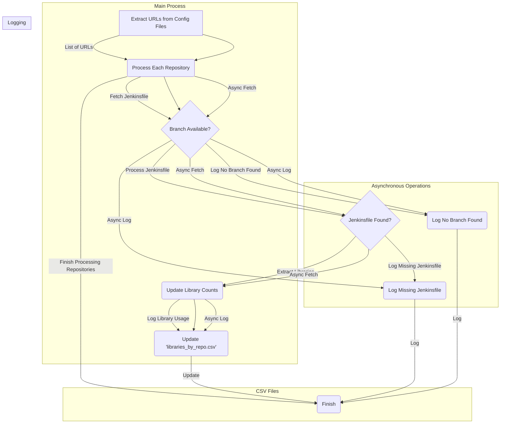

# Jenkins KPI Monitoring Dashboard

## Asynchronous Jenkinsfile Fetching and Library Extraction Process

### Process Overview

1. URL Extraction
The initial step involves extracting GitLab URLs from configuration files, resulting in a list of URLs.
2. Asynchronous Repository Processing
Each URL in the list is processed asynchronously, which includes fetching the Jenkinsfile, checking for branch availability, and logging if no branch is found. This asynchronous approach enhances overall system efficiency.
3. Branch Availability Check
For each repository, the system checks for the presence of the 'master' or 'main' branch. This step ensures that the system prioritizes these main branches for Jenkinsfile retrieval.
4. Jenkinsfile Retrieval
If the main branch is available, the system fetches the Jenkinsfile from the repository and checks for its existence in the specified branch. It proceeds to extract libraries if found; otherwise, it logs the absence.
5. Library Extraction and Count Update
Upon finding the Jenkinsfile, the system extracts library information from it. The extracted libraries are then used to update counts, tracking how many times each library is being used across all repositories.
6. Error Logging
The system logs errors in cases where the Jenkinsfile is not found or neither 'master' nor 'main' branches are available for a repository. This error logging helps in identifying issues for further investigation.
7. Library Usage Logging
For successful cases, the system logs the usage of libraries by each repository. This information is logged for later analysis.
8. CSV File Updates
The system updates two CSV files: 'libraries_by_repo.csv' and 'library_counts.csv'. The former records which libraries are used by each repository, while the latter captures the count of library usage across all repositories.
9. Process Completion
The entire process concludes after all repositories have been processed asynchronously.
Key Components

#### Asynchronous Operations

Asynchronous processing allows for parallel execution of tasks, significantly improving the overall speed and efficiency of the system.

- CSV Files
Two CSV files are utilized to store valuable information: 'libraries_by_repo.csv' records library usage by repository, and 'library_counts.csv' maintains the count of library usage.

- Error Logging
Error logs are generated for cases where the Jenkinsfile is not found or no suitable branch is available. These logs aid in identifying and resolving issues during or after the process.
Conclusion

#### Efficiency:
Asynchronous operations enhance efficiency by allowing parallel execution.
Documentation:
The diagram serves as comprehensive documentation, aiding understanding and troubleshooting.